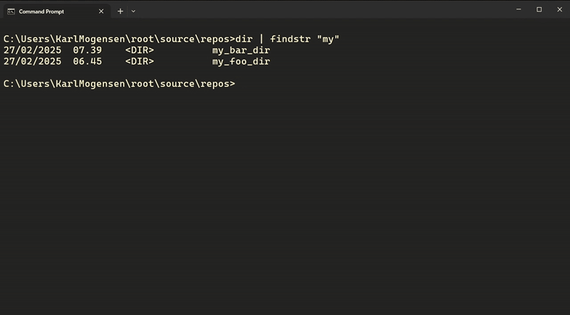

# batmobile
a bat script that turbocharges windows terminal navigation and replaces all needs for cd, cd.. and cd + TAB until match

## Replacing cd with c

Comparison:
go from current dir to domaintests

```plaintext
root
├── source
│   └── repos
│       ├── my_foo_dir
│       ├── my_bar_dir
│       │   ├── app
│       │   ├── apptests
│       │   ├── domain
│       │   └── domaintests  <--
```

Using the batmobile (c.bat) script:


Using cd:


## Replacing cd.. with c
Calling c without any arguments is the equivalent of calling cd..

## Replacing cd + TAB on multiple matches
using the "-l" command allows for choosing a match for a search that will then be remembered until the terminal session is ended



