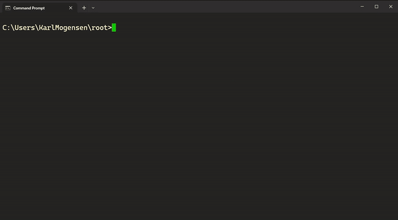
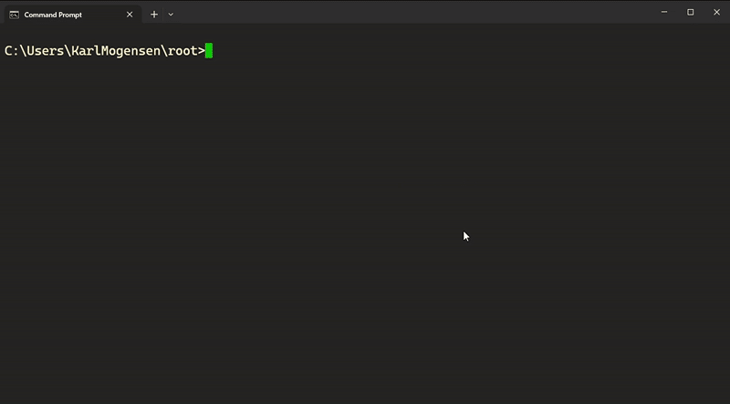

# batmobile
a bat script that turbocharges terminal navigation and replaces all needs for cd, cd.. and cd + TAB until match

Comparison:
go from current dir to domaintests

```plaintext
root
├── source
│   └── repos
│       ├── my_foo_dir
│       ├── my_bar_dir
│       │   ├── app
│       │   ├── apptests
│       │   ├── domain
│       │   └── domaintests  <--
```

<div style="display: flex; justify-content: space-between;">
  
  
</div>


## todos
- [X] Persist list choice for next resolve
- [X] multi string search support
 if the second input is not "-l" also do a string contains search on that
  - [X] update documentation
- [X] fix null file bug
 repro: c into dir - src dir now has weird file

- [-] Cool documentation
  - [X] comparison (use foobar thing)
    - [X] comparison multi string support
  - [X] new vid with more intricate paths + zoom
  - [X] make them exactly the same length time

  - [ ] comparison go back
  - [ ] persist choice on multiple match in terminal session


